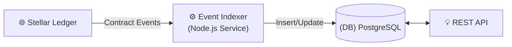
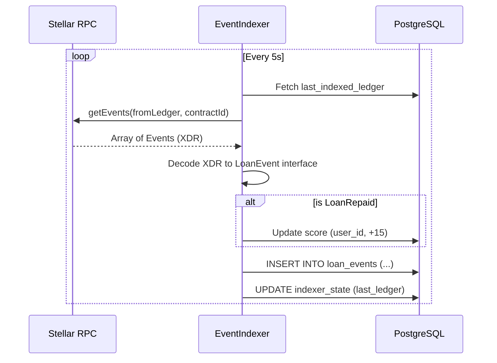

# Indexer and Database Synchronization

The RemitLend system maintains an off-chain database (PostgreSQL) that serves as a high-speed cache and metadata store, fully synchronized with the Stellar ledger via a custom indexer.

## System Architecture

## The Indexing Process (`EventIndexer`)

The indexer is a dedicated service within the backend that polls the Soroban RPC for specific contract events.

### 1. Polling Strategy
The indexer maintains its own state in the `indexer_state` table to ensure **idempotency** and **resumeability**.
- **State Tracked**: `last_indexed_ledger` and `last_indexed_cursor`.
- **Loop**: Requests continuous batches from the RPC starting from the last known ledger.

### 2. Event Decoding
Incoming XDR events are decoded for three primary types:
- `LoanRequested`: Syncs new loan records and borrower info.
- `LoanApproved`: Updates loan status and timestamps.
- `LoanRepaid`: Captures repayments and triggers credit score updates.

### 3. Reactive Score Adjustment
When a `LoanRepaid` event is detected, the indexer doesn't just record the payment—it actively updates the borrower's **Credit Score** in the `scores` table.
- **Logic**: Automatically increments the score (e.g., +15 points) upon successful full repayment.

---

## Technical Flow Diagram

## Data Schema Interaction

| Table | Indexer Action | Triggering Event |
| :--- | :--- | :--- |
| `loan_events` | Append | All Contract Events |
| `loans` (planned) | Update Status | `LoanRequested`, `LoanApproved`, `LoanRepaid` |
| `scores` | Increment/Decrement | `LoanRepaid`, `LoanDefaulted` |

## Recovery Mode
In case of a crash, the indexer can be re-pointed to any past ledger to "re-play" events into the database, ensuring no financial synchronization is ever lost.
