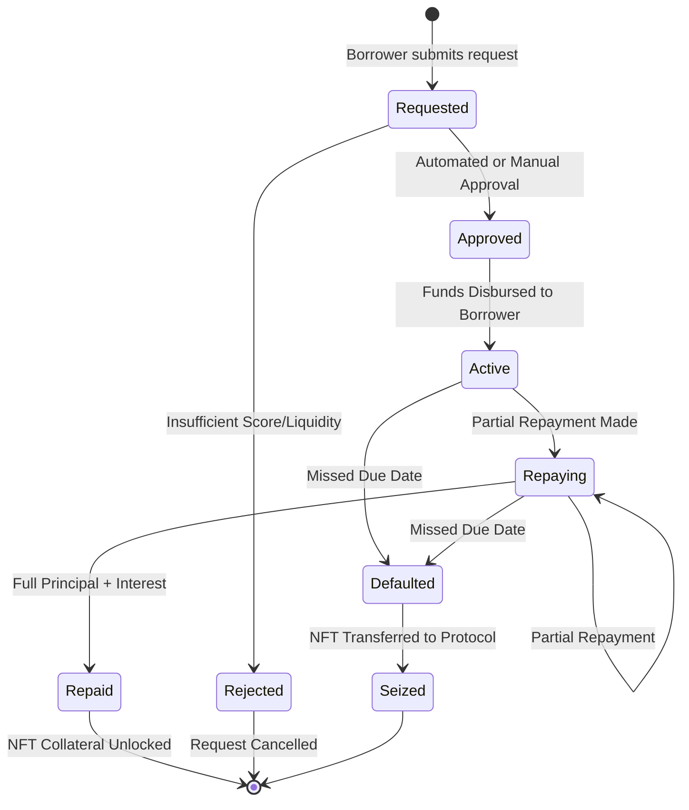

# Soroban Smart Contract Architecture

RemitLend leverages three core smart contracts built with Soroban (Rust) to manage decentralized lending.

## Loan Lifecycle State Machine

The complete loan lifecycle is managed as a state machine within the `Loan Manager` contract.

### 1. Requested
- **Action**: Borrower calls `request_loan(nft_id, amount)`.
- **Logic**:
    - Verifies NFT ownership.
    - Locks the NFT within the contract (Collateral).
    - Checks the credit score stored on the NFT.
    - Creates a `Loan` record with `Status: Requested`.

### 2. Approved
- **Action**: Lender/Admin calls `approve_loan(loan_id)`.
- **Logic**:
    - Checks required liquidity in the `Lending Pool`.
    - Reserves the loan amount.
    - Computes interest rate (LTV) and due date.
    - Transitions to `Approved`.

### 3. Active
- **Action**: Automatic on approval or separate `disburse_funds` call.
- **Logic**:
    - Transfers tokens from the `Lending Pool` directly to the Borrower.
    - Starts the interest accrual timer.

### 4. Repaid
- **Action**: Borrower calls `repay_loan(loan_id, amount)`.
- **Logic**:
    - Transfers tokens back to the `Lending Pool` (Principal + Interest).
    - If `outstanding == 0`:
        - Unlocks and returns the NFT to the original owner.
        - Signals score adjustment (emits `LoanRepaid` event).

---

## Contract Interplay

| Contract | Primary Responsibility | Key State Managed |
| :--- | :--- | :--- |
| **Remittance NFT** | Identity & Credit | Score, History Hash, Locked Status |
| **Loan Manager** | Lending Logic | Loan Balances, Status (Requested -> Repaid) |
| **Lending Pool** | Liquidity Manager | Total Deposits, Available Liquidity, Shares |

## Security & Integrity
- **Atomicity**: Soroban ensures all internal state updates and token transfers happen atomically.
- **Access Control**: Role-based permissions ensure only the `Loan Manager` can lock/unlock NFTs or allocate pool funds.
